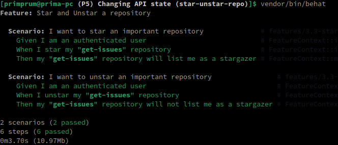
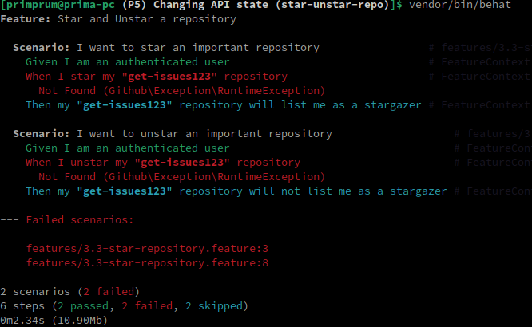

# Changing Github API state

This project will about to test the Star and Unstar functionality in Github API through authenticated request.

<br>

### What is the purpose of this test?

Starring and unstarring repositories is a fundamental feature of GitHub that allows users to bookmark projects and show their interest or support. Ensuring the accuracy of this functionality is crucial for maintaining user satisfaction and platform reliability.

<br>

**The feature consists of two scenarios:**

1. Scenario 1: Star an Important Repository
2. Scenario 2: Unstar an Important Repository

<br>

#### Scenario 1: Star an Important Repository

```gherkin
Given I am an authenticated user
When I star my "get-issues" repository
Then my "get-issues" repository will list me as a stargazer
```

This scenario ensures that when a user stars a repository named "get-issues," they are correctly listed as a stargazer.

#### Scenario 2: Unstar an Important Repository

```gherkin
Given I am an authenticated user
When I unstar my "get-issues" repository
Then my "get-issues" repository will not list me as a stargazer
```

This scenario verifies that when a user unstarrs the "get-issues" repository, they are no longer listed as a stargazer.

<br>

> The purpose of these scenarios is to ensure that the starring and unstarring functionality of GitHub repositories is working as expected. By automating these tests with Behat and PHP, we can ensure the reliability and consistency of this critical feature.

<br>

### How the Test Works

**Authentication:** <br> The test begins by authenticating the user with their GitHub token.

**Starring/Unstarring:** <br> Depending on the scenario, the user either stars or unstarrs the "get-issues" repository using the GitHub API.

**Verification:** <br> After starring or unstarring, the test checks whether the user is correctly listed as a stargazer or not, depending on the scenario.

<br>

### Running the Test

To run this test suite:

- Ensure you have Behat installed and configured.
- Set up your GitHub token in the behat.yml file.
- Run the Behat tests using the command line.

<br>

### Generating the functions

On our project workspace:

```bash
vendor/bin/bash
```

Then we choose to generate the FeatureContext file.

<br>

After that, we'll get the following functions:

```php
/**
     * @Given I am an authenticated user
     */
    public function iAmAnAuthenticatedUser()
    {
       // stuff
    }

   /**
     * @When I star my :arg1 repository
     */
    public function iStarMyRepository($arg1)
    {
        // stuff
    }

    /**
     * @When I unstar my :arg1 repository
     */
    public function iUnstarMyRepository($arg1)
    {
        // stuff
    }

    /**
     * @Then my :arg1 repository will list me as a stargazer
     */
    public function myRepositoryWillListMeAsAStargazer($arg1)
    {
        // stuff
    }

    /**
     * @Then my :arg1 repository will not list me as a stargazer
     */
    public function myRepositoryWillNotListMeAsAStargazer($arg1)
    {
        // stuff
    }
```

<br>

### Managing constructor to authenticate to the API

Inside FeatureContext.php we need to declare the variable as array:

```php
protected $params = [];
```

And then we assign the variable inside the constructor:

```php
public function __construct(array $parameters = [])
{
    $this->params = $parameters;
    $this->client = new \Github\Client();
}
```

<br>

### Given: I am an authenticated user

This generates function `iAmAnAuthenticatedUser()`.

In this case, we're gonna connect into Github API as an authenticated user. So, we do this:

```php
public function iAmAnAuthenticatedUser()
{
    $this->client->authenticate($this->params['github_token'], null, Github\AuthMethod::ACCESS_TOKEN);
}
```

<br>

### When: I star my :arg1 repositories

This generates function `iStarMyRepository($arg1)`.

We could then fill it with this:

```php
public function iStarMyRepository($arg1)
{
    // Retrieving the login (username) of the current GitHub user
    $githubUser = $this->client->api('current_user')->show()['login'];

    // Starring the repository with the given repository name (arg1) for the current user
    $this->client->api('current_user')->starring()->star($githubUser, $arg1);
}
```

<br>

### When: I unstar my :arg1 repository

This generates function `iUnstarMyRepository($arg1)`.

We could then fill it with this:

```php
public function iUnstarMyRepository($arg1)
{
    // Retrieving the login (username) of the current GitHub user
    $githubUser = $this->client->api('current_user')->show()['login'];

    // Unstarring the repository with the given repository name (arg1) for the current user
    $this->client->api('current_user')->starring()->unstar($githubUser, $arg1);
}
```

<br>

### Then: my :arg1 repository will list me as a stargazer

This generates function `myRepositoryWillListMeAsAStargazer($arg1)`.

We could then fill it with this:

```php
public function myRepositoryWillListMeAsAStargazer($arg1)
{
    // Retrieving the login (username) of the current GitHub user
    $githubUser = $this->client->api('current_user')->show()['login'];

    // Checking if the current user is listed as a stargazer of the repository
    if (!$this->isAStargazer($githubUser, $arg1)) {
        throw new Exception("Expected current user to be a stargazer of the '$githubUser/$arg1' repository but they were not.");
    }
}
```

<br>

### Then: my :arg1 repository will not list me as a stargazer

This generates function `myRepositoryWillNotListMeAsAStargazer($arg1)`.

We could then fill it with this:

```php
public function myRepositoryWillNotListMeAsAStargazer($arg1)
{
    // Retrieving the login (username) of the current GitHub user
    $githubUser = $this->client->api('current_user')->show()['login'];

    // Checking if the current user is not listed as a stargazer of the repository
    if ($this->isAStargazer($githubUser, $arg1)) {
        throw new Exception("Expected current user to not be a stargazer of the '$githubUser/$arg1' repository but they were.");
    }
}
```

<br>

Notice that above we have `isAStargazer()` function, so we need to create it first:

```php
protected function isAStargazer($user, $repo)
{
    // Retrieve all stargazers for the specified repository
    $_stargazers = $this->client->api('repo')->stargazers()->all($user, $repo);

    // Extract login names of stargazers and create an associative array for easier lookup
    $stargazers = array_column($_stargazers, 'login', 'login');

    // Check if the current user is listed as a stargazer
    return isset($stargazers[$user]);
}
```

<br>

### Different method of assertion

On the `isAStargazer()` function, we're using built-in PHP function `array_column()`, but we could actually use different method, such as `foreach()`.

If we want, we could write it like this in the `myRepositoryWillListMeAsAStargazer()`:

```php
/**
 * @Then my :arg1 repository will list me as a stargazer
 */
public function myRepositoryWillListMeAsAStargazer($arg1)
{
    // Retrieving the login (username) of the current GitHub user
    $githubUser = $this->client->api('current_user')->show()['login'];

    $repo = $githubUser . '/' . $arg1;
    $stargazers = $this->client->api('repo')->stargazers()->all($githubUser, $arg1);

    foreach($stargazers as $stargazer) {
        if ($githubUser == $stargazer['login']) {
            return true;
        }
    }

    throw new Exception("Expected $githubUser to be stargazer of the '$repo' repository but they were not");
}
```

<br>

And for `myRepositoryWillNotListMeAsAStargazer()` function:

```php
/**
 * @Then my :arg1 repository will not list me as a stargazer
 */
public function myRepositoryWillNotListMeAsAStargazer($arg1)
{
    // Retrieving the login (username) of the current GitHub user
    $githubUser = $this->client->api('current_user')->show()['login'];

    $repo = $githubUser . '/' . $arg1;
    $stargazers = $this->client->api('repo')->stargazers()->all($githubUser, $arg1);

    foreach($stargazers as $stargazer) {
        if ($githubUser == $stargazer['login']) {
            throw new Exception("Expected $githubUser to not be a stargazer of the '$repo' repository but they were");
        }
    }

    return true;
}
```

<br>

### Test result



And if we tried with non-existent repo:



<br>

### [Summary]

Through this test, we've learned several key aspects:

**Functionality Testing:** <br> We've verified that the starring and unstarring functionality of GitHub repositories works as intended. This ensures that users can effectively manage their starred repositories and accurately reflect their interests on the platform.

**Authentication Handling:** <br> The test demonstrates the ability to authenticate users using their GitHub tokens, enabling secure access to GitHub's API for performing actions such as starring and unstarring repositories.

**Automated Testing:** <br> By automating these test scenarios with Behat and PHP, we've established a reliable means of continuously testing the starring and unstarring feature. This automation helps catch potential issues early and ensures consistent behavior across different environments.

**User Experience Assurance:** <br> By ensuring that users are correctly listed as stargazers when they star a repository and are removed when they unstar it, we contribute to a positive user experience on GitHub. This attention to detail enhances user confidence and satisfaction with the platform.

**Platform Reliability:** <br> Ensuring the reliability of critical features like starring and unstarring repositories is essential for maintaining the overall reliability and trustworthiness of the GitHub platform. By thoroughly testing these functionalities, we contribute to the platform's stability and robustness.

<br>

> Overall, this test underscores the importance of rigorous testing to ensure the functionality, security, and user experience of GitHub's features, ultimately contributing to a seamless and reliable platform for developers and users worldwide.

<br>

### What This Test Can't Do

Despite its thoroughness, there are limitations to what this Behat test can achieve:

**Integration Testing:** <br> While this test verifies individual functionalities such as starring and unstarring repositories, it may not cover all possible integration scenarios.

> For example, it may not test how starring a repository affects other parts of the user interface or user interactions.

**Performance Testing:** <br> This test focuses on functional correctness and does not assess the performance of starring and unstarring actions under heavy loads or in various network conditions.

> Performance testing requires specialized tools and techniques beyond the scope of Behat.

**Security Testing:** <br> While the test ensures that users can authenticate and perform actions on GitHub repositories, it does not specifically test for security vulnerabilities or unauthorized access scenarios.

> Comprehensive security testing requires additional tools and methodologies tailored to security assessment.

**Cross-Platform Compatibility:** <br> Although Behat tests can run on different environments, this test may not cover all possible platform configurations or edge cases.

> Ensuring cross-platform compatibility may require additional testing strategies and environments.

**User Experience Variability:** <br> While the test verifies basic user experience aspects related to starring and unstarring repositories, it may not capture all possible user interactions or edge cases.

> User experience testing often involves qualitative assessment and usability studies in addition to automated testing.

<br>

**_Understanding these limitations helps guide the overall testing strategy and ensures that appropriate testing methodologies are applied to address various aspects of software quality beyond functional correctness._**
